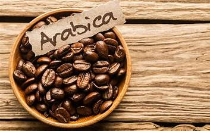

<html>
<head>
    <meta charset="UTF-8">
    <meta name="viewport" content="width=device-width, initial-scale=1.0">
    <title>Kedai Kopi</title>
    <!--font-->
    <link rel="preconnect" href="https://fonts.googleapis.com">
    <link rel="preconnect" href="https://fonts.gstatic.com" crossorigin>
    <link href="https://fonts.googleapis.com/css2?family=Poppins:ital,wght@0,100;0,200;0,300;0,400;0,500;0,600;0,700;0,800;0,900;1,100;1,200;1,300;1,400;1,500;1,600;1,700;1,800;1,900&display=swap" rel="stylesheet">
    <!--Feather Icons-->
    

    <!--my Style-->
    
</head>
<body>

    <!--Navbar star-->
    <nav class="Navbar">
        <a href="#" class="navbar-logo">kenangansenja,</a>

        

            <a href="#">home</a>
            <a href="#about">tentang kami</a>
            <a href="#menu">menu</a>
            <a href="#contact">kontak</a>
        

        

            <a href="#" id="search"><i data-feather="search"></i></a>
            <a href="#" id="shopping-cart"><i data-feather="shopping-cart"></i></a>
            <a href="#" id="hamburger-menu"><i data-feather="menu"></i></a>

        

    </nav>
    <!--Narvbar end-->

<!--hero section star-->
<section class="hero" id="home">
    <main class="content">
        <h1>mari menikmati secangkir Kopi</h1>
        
Biji Kopi Arabika Berkualitas, Terpercaya

        <a href="#"class='cta'>beli sekarang</a>
    </main>
</section>
<!--hero section end-->

<!--about section start-->
<section id="about"class="about">
    <h2>Tentang Kami</h2>

    

        

           
        

        

            <h3>Kenapa Memilih Kopi Kami</h3>
            
Kualitas biji kopi kami terjamin karena kami menerapkan beberapa standar penting,

                
- *Pemilihan biji kopi dengan warna konsisten dan bebas bintik hitam* yang menandakan biji kopi segar dan bebas jamur

                
- *Aroma biji kopi yang khas, segar, dan kuat*, sebagai indikator utama kesegaran dan kualitas kopi

                
   Dengan standar tersebut, kami memastikan Anda mendapatkan biji kopi dengan rasa seimbang, aroma kuat, dan kualitas terbaik dari petani terpercaya

    

</section>
<!--about section end-->

<!--menu section strat-->
<section id="menu" class="menu">
    <h2>Menu Kami</h2>
    
menu kami terdiri dari bji kopi arabika berkualitas yang berasal dari sumatera, dan vietnam

    

        

            
            <h3 class="menu-card-title">-arabika-</h3>
            
IDR 130K per kg

        

        

            
            <h3 class="menu-card-title">-arabika sumatera-</h3>
            
IDR 149K per kg

        

        

            
            <h3 class="menu-card-title">-arabika vietnam-</h3>
            
IDR 199K per kg

        

        

            
            <h3 class="menu-card-title">-arabika premium-</h3>
            
IDR 350K per kg

        

    

</section>
<!--menu section end-->

<!--contant section start-->
<section id="contact" class="contact">
    <h2>kontak Kami</h2>
    
Bila adanya kendala dalam pemesanan atau komplan bisa menghubungi kontak dibawah

    

        <iframe src="https://www.google.com/maps/embed?pb=!1m17!1m12!1m3!1d15840.62820064139!2d107.82861918210983!3d-6.990775639327415!2m3!1f0!2f0!3f0!3m2!1i1024!2i768!4f13.1!3m2!1m1!2s!5e0!3m2!1sid!2sid!4v1749377939462!5m2!1sid!2sid" allowfullscreen="" loading="lazy" referrerpolicy="no-referrer-when-downgrade" class="maps"></iframe>
        
        <form action="">
            

                <i data-feather="user"></i>
                <input type="text" placeholder="nama">
            

            

                <i data-feather="mail"></i>
                <input type="text" placeholder="email">
            

            

                <i data-feather="phone"></i>
                <input type="text" placeholder="nomer hp">
            

            <button type="submit" class="btn">Kirim Pesan</button>
        </form>
    

</section>
<!--contant section end-->

<!--footer start-->
<footer>
    

        <a href="#"><i data-feather="instagram"></i></a>
    

        <a href="#"><i data-feather="facebook"></i></a>
    

        <a href="#"><i data-feather="twitter"></i></a>
    

    

        <a href="#home">home</a>
        <a href="#about">Tentang Kami</a>
        <a href="#menu">menu</a>
        <a href="#contact">kontak</a>
    

    

        
credit by <a href="">Yudi prahasta adi sukma</a> &copy; 2025

    

</footer>
<!--footer end-->

    <!--Feather icons-->
    

      <!--my javascript-->
      
</body>
</html>
